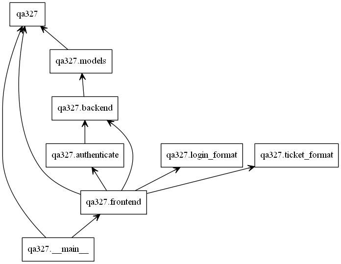

# Design Document

## Structure

For the most part, the structure of this software
will match the template.
However,
logic that can be easily separated,
such as login / register validation,
should be refactored into other files.
Applying this pattern enforces 
the Single Responsibility Principle,
which minimizes convolution of concerns.
In addition,
to achieve the simplest possible implementation,
small, pure functions are preferred to
implicit object state.
This also makes testing easier,
as the outputs of each function are
designed to be consistent.

The front end of the program has the responsibilities of being the interface with the user. 
Here, the user is able to enter their information into forms to login and register as a new user, in `/login` and `/register` respectively. The frontend has the responsibility to ensure validity and correct formatting
in all of the submitted information, as outlined in the requirements. This will maintain consistent data storage. The front end does not interact with the database, but requests
information through the backend and uses POST methods to enter new information.

The backend of the program has the responsibility of writing and reading 
information to and from the database. The backend starts new sessions, saves new
users, updates user information and will retrieve user information. Moreover, the
backend is responsible for database security as no information can be accessed without 
appropriate permissions such as valid passwords.

## Function Descriptions

| File Name | Method | Intention |
|--|--|--|
| `frontend.py` | | |
| | **register_get** |  If a user is logged in redirect to the home page, otherwise redirect to register   :return: home page if logged in, register page if not logged in  |
| | **register_post** |  Intake register form information and validate that all entered information follows requirements R1 (login) and R2 (register). :return: if requirement not met, error page with specific error message :return: if requirements met, redirect to login page  |
| | **login_get** |  If user is logged in, redirect to home page, otherwise redirect to login  |
| | **login_post** |  Intake all login form information and validate using login_user then redirect to home  |
| | **logout** |  When user logs out, remove logged in user and redirect to home page :return: redirect to home page  |
| | **authenticate** |  param inner_function: any python function that accepts a user object Wrap any python function and check the current session to see if the user has logged in. If login, it will call the inner_function with the logged in user object. |
| | **profile** |  authentication is done in the wrapper function see above  |
| | **page_not_found** |  Handle 404 errors :param error: error message :return: display a 404 error page  |
| `backend.py` | | |
| | **get_user** | Get a user by a given email :param email: the email of the user :return: a user that has the matched email address |
| | **login_user** | Check user authentication by comparing the password :param email: the email of the user :param password: the password input :return: the user if login succeeds |
| | **register_user** | Register the user to the database :param email: the email of the user :param name: the name of the user :param password: the password of user :param password2: another password input to make sure the input is correct :return: an error message if there is any, or None if register succeeds |
| `login_format.py` | | |
| | **is_valid_password()** | Returns boolean indicating whether a password is valid, according to R1 and R2 password definitions |
| | **is_valid_email()** | Returns a boolean indicating whether an email is valid, according to RFC 5322 requirements, using the `validate_email` library  |
| | **is_valid_username()** | Returns boolean indicating whether a username is valid, according to R1 and R2 username definitions |

## Program Diagram

### Description

The **diagram to the left** details the attributes of the user model. This has the attributes balance, email, id, name and password. These attributes contain the user's account balance, the email for their account, the user id name, the name of the individual associated with that account, and their account password, respectively. 

The **diagram to the right** shows the relationships between packages in the program. The main program `qa327`, inherits methods and functions, from almost all other programs. The outlier is `login_format`, as it is used to validate inputted user information within the `frontend` program.

As a whole, the `__main__.py` program will instantiate the website by running the server. When the user interacts with the website, `frontend.py` will handle the various http requests from the client by redirecting the user to the appropriate page and posting requests for them. Whenever the user enters information into the client, `frontend.py` uses functions defined in `login_format.py` to ensure correct formatting and validity of information as outlined in the requirements. `frontend.py` intakes information and passes it to `backend.py` to perform any database operations (eg. reading, writing, updating etc.) with `models.py`.

## Code Style

To establish a consistent and clear coding style,
the team has decided to follow some of the
[PEP-8](https://www.python.org/dev/peps/pep-0008/)
conventions.
To guarantee that the team adheres to these guidelines,
the PyLint tool will be used.
A custom linter configuration will also be created from
the default template,
such that style rules can be adjusted to
the team's preference and application. PyLint's scoring system will be used to ensure code meets clarity objectives as only code with a score of **9/10 or higher** is acceptable. 

### Code Style Examples
* Snake case for variable names
* Using four spaces for indentation
* All constant variables have format `CONSTANT_NAME`
* All boolean values have format `is_NAME`
* All lists variables are plural, .i.e `users`

## Test Plan

Test cases of different levels,
such as frontend, backend, and integration tests
will be organized into separate folders.
Using this method,
different levels of tests can be run in isolation.
This will be especially useful for team members
who are working on frontend and backend tests,
and don't want the integration tests 
slowing down their development.
Given that each level of testing is independent,
there are minimal restrictions on the testing order.
However, frontend and backend testing should be
attempted before integration testing,
as these will find bugs more explicitly.
Team members will be assigned as in charge of test cases
by endpoint / function.
If the team is unclear on who is in charge of
a particular test case,
then commands such as `git blame` can be used to determine
who was working on a module.

In terms of environments and tooling,
the provided tools has been determined to be sufficient.
That is, PyTest will be used for unit tests,
and Selenium will be applied for integration testing.
By choosing this standard workflow,
reproducing test results in a cloud environment
should be seamless.
One thign that the team will have to pay attention to
is explicitly adding dependencies to `requirements.txt`,
such that third party libraries are also installed on
the cloud environment.
To minimize budget costs,
CI will only be run on pull requests.
As such, most of the testing will occur locally
on the machines of the team members.
By the time a pull request is made,
it should ideally already be passing tests,
though CI will confirm this.