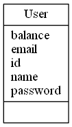
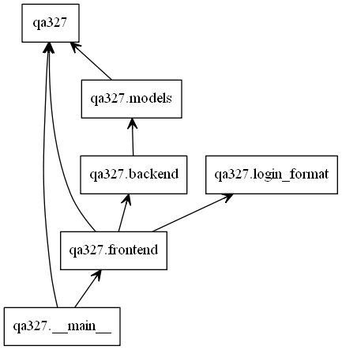

# Design Document

## Structure

For the most part, the structure of this software
will match the template.
However,
logic that can be easily separated,
such as login / register validation,
should be refactored into other files.
Applying this pattern enforces 
the Single Responsibility Principle,
which minimizes convolution of concerns.
In addition,
to achieve the simplest possible implementation,
small, pure functions are preferred to
implicit object state.
This also makes testing easier,
as the outputs of each function are
designed to be consistent.

The front end of the program has the responsibilities of being the interface with the user. 
Here, the user is able to input the their information to login into the database,
or register as a new user. The frontend has the responsibility to ensure validity
in all of the inputted information, and ensures that the information abides by
certain format standards, as outlined in the assignment, such that data storage
remains consistent. The frontend does not interact with the database, but requests
information through the backend.

The backend of the program has the responsibility of writing and reading 
information to and from the database. The backend starts new sessions, saves new
users, updates user information and will retrieve user information. Moreover, the
backend is responsible for database security as no information can be accessed with 
appropriate permissions such as valid passwords.

## Function Descriptions

| Function Name | Function Description |
| -- | -- |
| **is_valid_password()** | Returns boolean indicating whether a password is valid, according to R1 and R2 password definitions |
| **valid_rfc_local_part()** | Returns a boolean indicating whether the local part of an email is valid, according to RFC 5322 requirements  |
| **valid_rfc_domain()** | Returns a boolean indicating whether the domain part of an email is valid, according to RFC 5322 requirements |
| **is_valid_email()** | Returns a boolean indicating whether an email is valid, according to RFC 5322 requirements, using the helper functions `valid_rfc_local_part()` and `valid_rfc_domain()` respectively  |
| **is_valid_username()** | Returns boolean indicating whether a username is valid, according to R1 and R2 username definitions |

## Program Diagram

## Code Style

To establish a consistent and clear coding style,
the team has decided to follow 
[PEP-8](https://www.python.org/dev/peps/pep-0008/)
conventions.
To guarantee that the team adheres to these guidelines,
the PyLint tool will be used.
A custom linter configuration will also be created from
the default template,
such that style rules can be adjusted to
the team's preference and application.

### Code Style Examples
* Snake case for variable names
* Using four spaces for indentation
* Limit all lines to a maximum of 79 characters
* All constant variables have format `CONSTANT*NAME`
* All boolean values have format `is_NAME`
* All lists variables are plural, .i.e `users`

## Test Plan

Test cases of different levels,
such as frontend, backend, and integration tests
will be organized into separate folders.
Using this method,
different levels of tests can be run in isolation.
This will be especially useful for team members
who are working on frontend and backend tests,
and don't want the integration tests 
slowing down their development.
Given that each level of testing is independent,
there are minimal restrictions on the testing order.
However, frontend and backend testing should be
attempted before integration testing,
as these will find bugs more explicitly.
Team members will be assigned as in charge of test cases
by endpoint / function.
If the team is unclear on who is in charge of
a particular test case,
then commands such as `git blame` can be used to determine
who was working on a module.

In terms of environments and tooling,
the provided tools has been determined to be sufficient.
That is, PyTest will be used for unit tests,
and Selenium will be applied for integration testing.
By choosing this standard workflow,
reproducing test results in a cloud environment
should be seamless.
One thign that the team will have to pay attention to
is explicitly adding dependencies to `requirements.txt`,
such that third party libraries are also installed on
the cloud environment.
To minimize budget costs,
CI will only be run on pull requests.
As such, most of the testing will occur locally
on the machines of the team members.
By the time a pull request is made,
it should ideally already be passing tests,
though CI will confirm this.